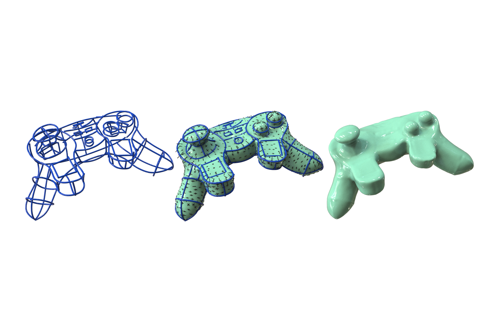

# Variational Neural Surfacing of 3D Sketches

Code of Variational Neural Surfacing of 3D Sketches. ACM Transactions on Graphics (SIGGRAPH Asia 2025).

[**Project Page**](https://zytadam.github.io/publications/vns/) &nbsp;/ [**Paper**](https://dl.acm.org/doi/10.1145/3757377.3763900)



### 1. Requirements

Our code uses [PyTorch](https://pytorch.org/).

The code was tested with Python 3.11, torch 2.5.1, CUDA 12.1 on Ubuntu 22.04.


### 2. Reconstruction of a 3D sketch

1. Put your data (*.obj) to ./data/sdf/input, some data already exists. We recommend applying a resampling preprocessing if your sketch consists of a mass of tiny segments.

2. Switch to the folder surface_reconstruction, run ./run_sdf_recon.py to reconstruct the surface. **The script will reconstruct all shapes under the ./data/sdf/input (\*.obj) files**

```
cd surface_reconstruction
python run_sdf_recon.py
```

**Results mesh are saved in ./surface_reconstruction/log/sdf/<object_name>/mesh**


### Acknowledgements

This code is heavily based of [Neural Singular Hessian](https://github.com/bearprin/Neural-Singular-Hessian).

Thanks to their impressive work.

### Bibtex

```bash
@article{Zhang2025VariationalNS,
  title={Variational Neural Surfacing of 3D Sketches},
  author={Yutao Zhang and Stephanie Wang and Mikhail Bessmeltsev},
  journal={Proceedings of the SIGGRAPH Asia 2025 Conference Papers},
  year={2025},
  month=dec,
  doi={10.1145/3757377.3763900}
}
```


